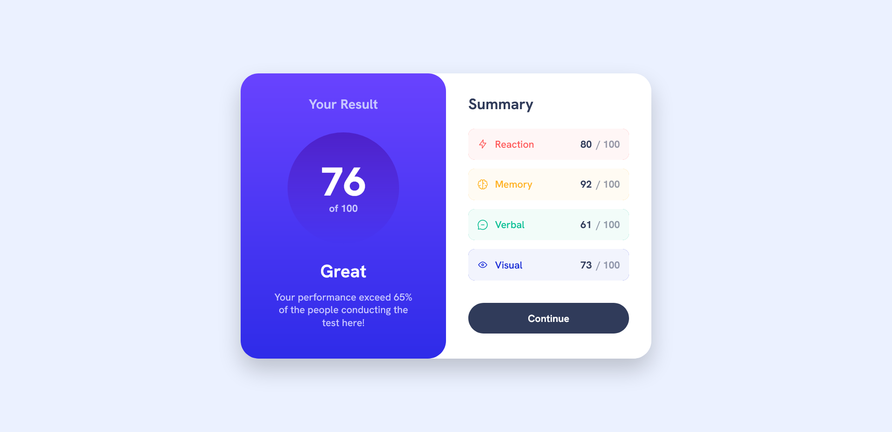

# Frontend Mentor - Results summary component solution

This is a solution to the [Results summary component challenge on Frontend Mentor](https://www.frontendmentor.io/challenges/results-summary-component-CE_K6s0maV). Frontend Mentor challenges help you improve your coding skills by building realistic projects.

## Table of contents

- [Welcome](#welcome)
- [Screenshot](#screenshot)
- [Links](#links)
- [My process](#my-process)
- [Built with](#built-with)
- [What I learned](#what-i-learned)
- [Continued development](#continued-development)
- [Author](#author)

## Welcome! 👋

My Name is Saurav Kumar verma i've completed the front-end mentor challenge and created the component to look as close as possible to the design provided, made it responsive to web and mobile devices, following best practices, and focused on minute details.

### Screenshot

### Links

- [Solution URL](https://github.com/Saurav-98/Results_summary_component)
- [Live Site URL](https://result-summary-saurav.netlify.app/)

## My process

In order to get more comfortable with the fundamentals, I didn't use anything not included in the vanilla HTML and CSS. I used Vite.js for front-end tooling to use the power of npm whenever required and generated the build version of the project with minified HTML and CSS.

Started with Desktop first Approach and moved to smaller screens making it responsive.

The component is simple, but it took more time than I expected to get it completed, and it also required extra efforts to understand the colors and shades with HSL values and gradients.

### Built with

- Semantic HTML5 markup
- CSS custom properties
- Flexbox
- CSS Grid
- Desktop-first workflow

### Continued development

However, I am satisfied with the end result and will continue to look over the code to make it more efficient as possible.

## Author

- [Saurav-98](https://github.com/Saurav-98)
